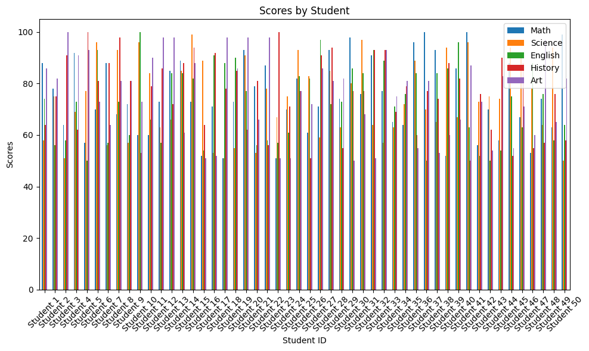
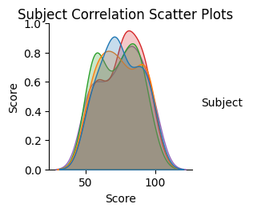
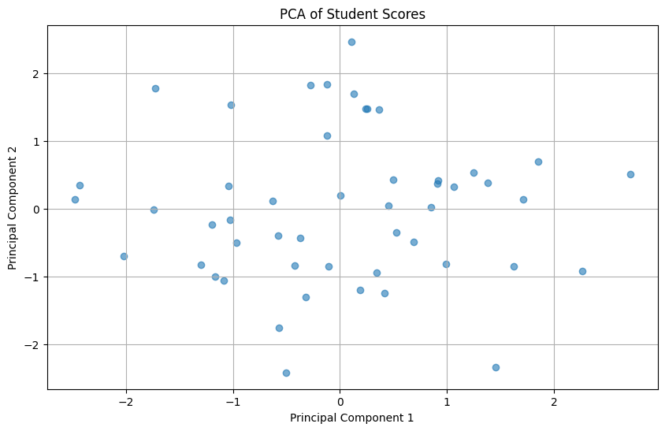

# DS5
適当なREADME.MDの例

# 学生成績分析プロジェクト

このプロジェクトは、学生の成績データを分析し、視覚化するためのPythonスクリプトを提供します。

## 機能

このスクリプトは以下の機能を提供します：

1. 学生の成績データの生成
2. 各学生の科目別得点を示す棒グラフの作成
3. 科目間の相関を示す散布図の作成
4. 主成分分析（PCA）を用いたデータの次元削減と可視化

## 必要なライブラリ

- pandas
- numpy
- matplotlib
- seaborn
- scikit-learn

## 使用方法

1. 必要なライブラリをインストールします：

pip install pandas numpy matplotlib seaborn scikit-learn

2. スクリプトを実行します：

python student_scores_analysis.py
   
3. 実行後、以下の3つのグラフが生成されます：
- `bar_chart_scores.png`: 学生ごとの科目別得点を示す棒グラフ
- `scatter_plot_correlations.png`: 科目間の相関を示す散布図
- `pca_plot.png`: 主成分分析の結果を示す散布図

## グラフの説明

### 棒グラフ（bar_chart_scores.png）

このグラフは、各学生の科目別得点を棒グラフで表示します。横軸は学生ID、縦軸は得点を示しています。各色は異なる科目を表しています。

### 散布図（scatter_plot_correlations.png）

このグラフは、各科目間の相関を散布図で表示します。対角線上には各科目の得点分布のカーネル密度推定が表示されます。

### PCAプロット（pca_plot.png）

このグラフは、5次元の成績データを2次元に削減した結果を散布図で表示します。各点は1人の学生を表し、近い位置にある点は類似した成績パターンを持つ学生を示します。

## 注意事項

このスクリプトは、ランダムに生成されたサンプルデータを使用しています。実際の分析には、実データを使用することをお勧めします。
